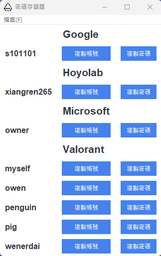

# Password_Manager

Python tkinter UI + RSA_AES加密 
密碼管理器

<!-- PROJECT LOGO -->
<br />

<p align="center">
  <a href="https://github.com/20051224/Password_Manager">
    
  </a>
</p>
 
## 目錄

- [上手指南](#上手指南)
  - [安裝環境](#安裝步驟)
- [文件目錄說明](#文件目錄說明)

###### **安裝步驟**

1. 使用python pip指令
```python
pip install -r requirements.txt
```


### 文件目錄說明
eg:

```
filetree 
├── RSA (esp32上傳檔)
│  └── RSA.ino (RSA密鑰)
├── app.ico (app圖示)
├── README.md 
├── main.py (主程式)
└── public.pem (RSA公鑰)
```
